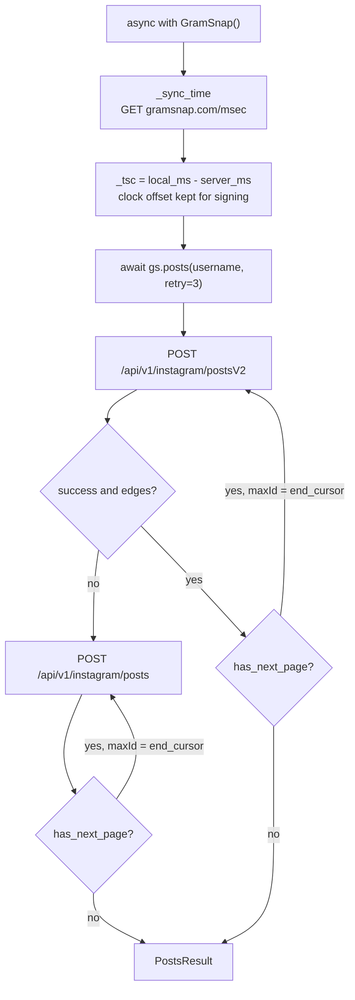
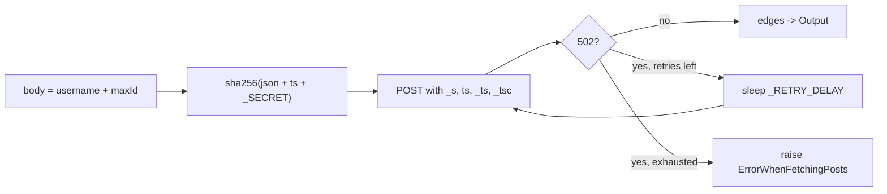
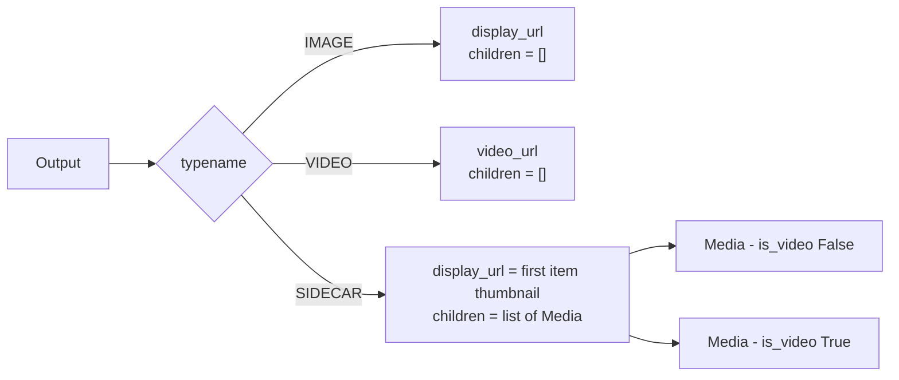

# GramSnap

Async Python client for the GramSnap Instagram viewer API.

## Usage

```python
import asyncio
from gramnsap import GramSnap, ErrorWhenFetchingPosts

async def main():
    async with GramSnap() as gs:
        try:
            result = await gs.posts("username", retry=3)  # default: 3, use -1 for infinite retry
        except ErrorWhenFetchingPosts as e:
            print(f"Failed to fetch posts, collected {len(e.posts)} posts")
            return

        for p in result:
            print(f"[{p.typename.name}] {p.url} likes={p.likes}")

asyncio.run(main())
```

## How it works

Entering the context manager syncs the local clock against the server before any
request is signed. `posts()` then walks the v2 endpoint page by page, falling back
to v1 if v2 reports no result:



Pagination is a cursor chain: each request needs the previous response's
`end_cursor`, so pages of a single account cannot be fetched in parallel.

Every request is signed and retried on 502:



## Retry behavior

The `retry` parameter on `posts()` controls how many times a failed request (HTTP 502) is retried:

| Value | Behavior |
|-------|----------|
| `retry=3` (default) | Retry up to 3 times per page, raise `ErrorWhenFetchingPosts` on failure |
| `retry=-1` | Retry indefinitely until success |
| `retry=0` | No retries, raise immediately on 502 |

`ErrorWhenFetchingPosts` contains `.posts` (successfully collected posts before failure).

## Output fields

| Field | Type | Description |
|-------|------|-------------|
| `id` | `str` | Post ID |
| `shortcode` | `str` | Post shortcode |
| `typename` | `MediaType` | `IMAGE`, `VIDEO`, or `SIDECAR` |
| `is_video` | `bool` | Whether the post is a video |
| `display_url` | `str` | Main image/thumbnail URL |
| `width` / `height` | `int` | Dimensions |
| `caption` | `str` | Post caption |
| `likes` | `int` | Like count |
| `comments` | `int` | Comment count |
| `timestamp` | `int` | Unix timestamp |
| `video_url` | `str \| None` | Video URL (videos only) |
| `video_views` | `int \| None` | View count (videos only) |
| `children` | `list[Media]` | Child media (sidecars only) |
| `url` | `str` | Instagram post URL (property) |

## Media types

`SIDECAR` is Instagram's name for a carousel post — several photos or videos
swiped through inside a single post.

| `MediaType` | v2 `__typename` | v1 `media_type` | Meaning |
|-------------|-----------------|-----------------|---------|
| `IMAGE` | `GraphImage` | `1` | Single photo |
| `VIDEO` | `GraphVideo` | `2` | Single video |
| `SIDECAR` | `GraphSidecar` | `8` | Carousel of several items |



Only `SIDECAR` posts populate `children`. A carousel's own `is_video` is always
`False` even when it contains videos, so filtering on `is_video` alone silently
skips them — walk `children` as well:

```python
for p in result:
    if p.typename == MediaType.VIDEO:
        print(p.video_url)
    elif p.typename == MediaType.SIDECAR:
        for c in p.children:
            if c.is_video:
                print(c.video_url)
```

## Disclaimer

This project is an unofficial client and all copyrights belong to **GramSnap**. This repository will be taken down immediately upon request from the GramSnap team. If you are a representative of GramSnap and wish to have this repository removed, please open an issue or contact the maintainer directly.
